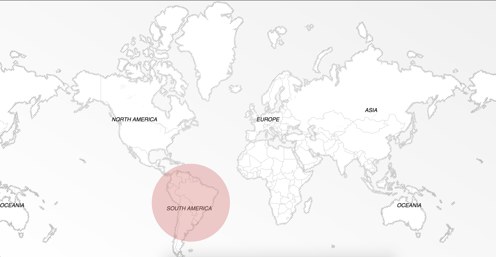
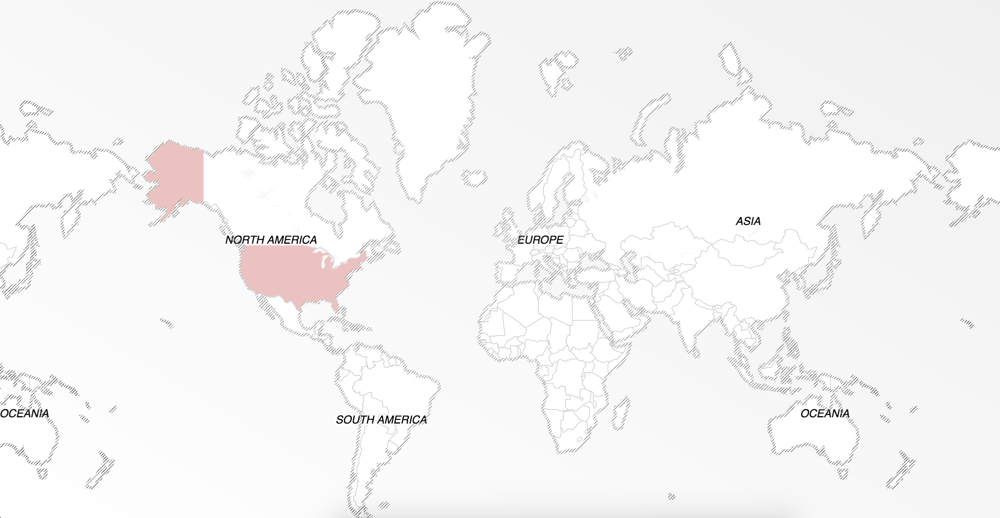

# Autocomplete

If you are building an end-user application, you can use the `/autocomplete` endpoint alongside `/search` to enable real-time feedback. This type-ahead functionality helps users find what they are looking for, without requiring them to fully specify their search term. Typically, the user starts typing and a drop-down list appears where they can choose the term from the list below.

To build a query with autocomplete, you need a `text` parameter, representing what a user has typed into your application so far. Optionally, you can specify a geographic point where the search is focused, this will allow users to see more local places in the results.

## User experience guidelines

There are several user experience pitfalls to watch out for when implementing a client-side typeahead solution:

### Requests must be throttled

Since autocomplete requests generally correspond directly to user input, it's important to account for fast typers and throttle requests. Some devices and networks (for example, mobile phones on a slow connection) may respond poorly when too many requests are sent too quickly, so be sure to do some testing on your own. [Learn more in this interactive demo.](http://jsfiddle.net/missinglink/19e2r2we/)

Our testing shows that between 5 and 10 requests per second is the range with the best balance of
resource usage and autocomplete responsiveness.

### Account for asynchronous, out of order responses

You cannot be sure responses will be returned in the same order they were requested. If you were to
send two queries synchronously, first `'Lo'` then `'London'`, you may find the `'London'` response
would arrive before the `'Lo'` response. This will result in a quick flash of `'London'` results
followed by the results for `'Lo'`, which can confuse the user.

Autocomplete requests with more characters typed will often return faster, since the search space of
the query is smaller, so this is not an edge case.

### Use search even with autocomplete

While the autocomplete endpoint is designed specifically for use with user-entered inputs, the
search endpoint can still be useful in certain situations. A common paradigm is to send an
autocomplete request on key presses (throttling appropriately as described earlier), but sending a
_search_ request when the user hits the `enter` key or a submit button.

This approach allows for the speed and partial-input handling of the autocomplete endpoint to be
used when needed, and the accuracy and additional functionality of the search endpoint to be used
when possible.

In our experience, most users have been trained by other websites that submit buttons paired with an
autocomplete interface will trigger a "more in depth" search, and so will naturally use this
ability.

### Use a pre-written client library if possible

If you are already using [Leaflet](https://leafletjs.com/), we recommend using the Nextzen (previously Mapzen)
[leaflet-geocoder](https://github.com/nextzen/leaflet-geocoder) plugin. This plugin follows all the
autocomplete guidelines listed here and has been well vetted by many members of our community.

## Set the number of results returned

By default, Places results up to 10 places, unless otherwise specified. If you want a different number of results, set the `size` parameter to the desired number. This example shows returning only the first result.

| parameter | value |
| :--- | :--- |
| `text` | YMCA |
| `size` | 1 |

> /v1/autocomplete?text=YMCA&__size=1__

If you want 25 results, you can build the query where `size` is 25.

> /v1/autocomplete?text=YMCA&__size=25__

## Global scope, local focus

To focus your search based upon a geographical area, such as the center of the user's map or at the device's GPS location, supply the parameters `focus.point.lat` and `focus.point.lon`. This boosts locally relevant results higher. For example, if you search for `Union Square`:

From San Francisco:

> /v1/autocomplete?__focus.point.lat=37.7&focus.point.lon=-122.4__&text=union square

```
1)	Union Square, San Francisco County, CA
2)	Union Square, New York County, NY
```

From New York City:

> /v1/autocomplete?__focus.point.lat=40.7&focus.point.lon=-73.9__&text=union square

```
1)	Union Square, New York County, NY
2)	Union Square, San Francisco County, CA
```

The `/autocomplete` endpoint can promote nearby results to the top of the list, while still allowing important matches from farther away to be visible. For example, searching `hard rock cafe` with a focus on Berlin:

> /v1/autocomplete?__focus.point.lat=52.5&focus.point.lon=13.3__&text=hard rock cafe

with `focus.point` you will find the Berlin restaurant first:
```
1)	Hard Rock Cafe Berlin, Berlin, Germany
2)	Hard Rock Café, San Giljan, Malta
```

without `focus.point` you will find the most popular restaurants first:
```
1)	Hard Rock Cafe, Pune, Maharashtra
2)	Hard Rock Café, San Giljan, Malta
```

## Filters

You can filter the results in several ways: the original data source and/or the type of record.

### Sources

The `sources` parameter allows you to specify from which data sources you'd like to receive results. The sources are as follows

* `openstreetmap` or `osm`
* `openaddresses` or `oa`
* `geonames` or `gn`
* `whosonfirst` or `wof`

> /v1/autocomplete?__sources=openaddresses__&text=pennsylvania

with `sources=openaddresses` you will only find addresses on Pennsylvania Ave or Street:
```
1) 8 R Pennsylvania Avenue, Amity, PA, USA
2) 7 Pennsylvania Avenue, Amity, PA, USA
3) 9 Pennsylvania Avenue, Cherry, PA, USA
```

without `sources=openaddresses` you will find the most popular Pennsylvanias first:
```
1) Pennsylvania, USA
2) Pennsylvania Avenue Heights, Washington, DC, USA
3) Pennsylvania, Satsuma, AL, USA
```

### Layers

The type of record is referred to as its `layer`. All records are indexed into the following layers:

|layer|description|
|----|----|
|`venue`|points of interest, businesses, things with walls|
|`address`|places with a street address|
|`street`|streets,roads,highways|
|`country`|places that issue passports, nations, nation-states|
|`macroregion`|a related group of regions. Mostly in Europe|
|`region`|states and provinces|
|`macrocounty`|a related group of counties. Mostly in Europe.|
|`county`|official governmental area; usually bigger than a locality, almost always smaller than a region|
|`locality`|towns, hamlets, cities|
|`localadmin`|local administrative boundaries|
|`borough`| a local administrative boundary, currently only used for New York City|
|`neighbourhood`|social communities, neighbourhoods|
|`coarse`|alias for simultaneously using all administrative layers (everything except `venue` and `address`)|
|`postalcode`|postal code used by mail services|

> /v1/autocomplete?__layers=coarse__&text=starbuck

with `layers=coarse` you will see only administrative areas with names containing Starbuck

```
1) Starbuckville, NY, USA
2) Starbuck, MN, USA
3) Starbuck, WA, USA
```

with `layers=venue` you will see only the venues by that name

```
1) Starbucks, Braunschweig, Germany
2) Starbucks, Islip, NY, USA
3) Starbucks, Austin, TX, USA
```

### Search within a circular region



Sometimes you don't have a rectangle to work with, but rather you have a point on earth&mdash;for example, your location coordinates&mdash;and a maximum distance within which acceptable results can be located.

In this example, you want to find all YMCA locations within a 35-kilometer radius of a location in Ontario, Canada. This time, you can use the `boundary.circle.*` parameter group, where `boundary.circle.lat` and `boundary.circle.lon` is your location in Ontario and `boundary.circle.radius` is the acceptable distance from that location. Note that the `boundary.circle.radius` parameter is always specified in kilometers.

> /v1/autocomplete?text=YMCA&__boundary.circle.lon=-79.186484&boundary.circle.lat=43.818156&boundary.circle.radius=35__

| parameter | value |
| :--- | :--- |
| `text` | YMCA |
| `boundary.circle.lat` | 43.818156 |
| `boundary.circle.lon` | -79.186484 |
| `boundary.circle.radius` | 35 |

You can see the results have fewer than the standard 10 items because there are not that many YMCA locations in the specified radius:

* YMCA, Toronto, Ontario
* YMCA, Markham, Ontario
* YMCA, Toronto, Ontario
* Metro Central YMCA, Toronto, Ontario
* Pinnacle Jr YMCA, Toronto, Ontario
* Cooper Koo Family Cherry Street YMCA Centre, Toronto, Ontario

### Country



Sometimes your work might require that all the search results be from a particular country or a list of countries. To do this, you can set the `boundary.country` parameter value to a comma separated list of alpha-2 or alpha-3 [ISO-3166 country code](https://en.wikipedia.org/wiki/ISO_3166-1).

## Available autocomplete parameters

| Parameter | Type | Required | Default | Example |
| --- | --- | --- | --- | --- |
| `text` | string | yes | none | `Union Square` |
| `focus.point.lat` | floating point number | no | none | `48.581755` |
| `focus.point.lon` | floating point number | no | none | `7.745843` |
| `boundary.rect.min_lon` | floating point number | no | none | `139.2794` |
| `boundary.rect.max_lon` | floating point number | no | none | `140.1471` |
| `boundary.rect.min_lat` | floating point number | no | none | `35.53308` |
| `boundary.rect.max_lat` | floating point number | no | none | `35.81346` |
| `boundary.circle.lat` | floating point number | no | none | `43.818156` |
| `boundary.circle.lon` | floating point number | no | none | `-79.186484` |
| `boundary.circle.radius` | floating point number | no | 50 | `35` |
| `sources` | string | no | all sources: osm,oa,gn,wof | openstreetmap,wof |
| `layers` | string | no | all layers: address,venue,neighbourhood,locality,borough,localadmin,county,macrocounty,region,macroregion,country,coarse,postalcode | address,venue |
| `boundary.country` | string | no | none | `GBR,FRA` |
| `boundary.gid` | Places `gid` | no | none | `whosonfirst:locality:101748355` |
| `size` | integer | no | 10 | 20 |
